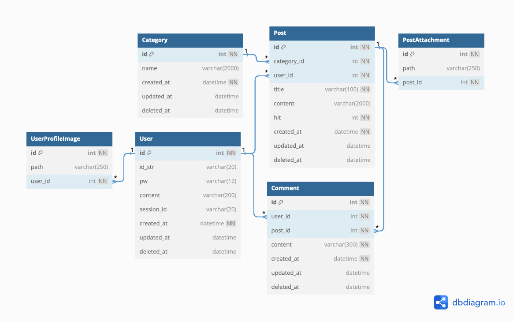

# ERD

## 2023.12.11.

### 변경 내역

- `Contact.name`(연락 방법)을 varchar(20) -> `type_id` int FK로 변경.
    - 기존에는 `github`, `linkedin`, `email` 같은 것을 직접 적어넣으려 했음.
    - [코드 리뷰](https://github.com/cheesecat47/myBlog/pull/17#discussion_r1421726801)에서 종류가 정해진 값이니 varchar보다 int를 쓰는것은 어떻겠냐는 의견이 있었음.
    - Enum을 사용해보려 했으나, Enum 보다는 참조 테이블을 사용하는 편이 테이블 설계나 데이터 조작 면에서 더 낫다는 블로그 글을 참고하여 테이블로 분리하고, `Contact.type_id`는 FK로 설정.
        - https://velog.io/@leejh3224/번역-MySQL의-ENUM-타입을-사용하지-말아야-할-8가지-이유
- `Blog` 테이블 추가
    - 블로그 이름, 개설일 같은 메타데이터 저장.
    - `Category.blog_id` FK 추가.
- `PostThumbnailImage` 테이블 추가
    - 포스트 썸네일 파일 저장.

## 2023.12.09.

### 변경 내역

- Footer에서 이메일, 깃허브, 링크드인 같은 연락처 정보를 보여주려 했는데, 이전 버전의 User 테이블에는 해당 정보를 담는 컬럼이 없음.
    - 참고: [화면 설계서](https://github.com/cheesecat47/myBlog/blob/main/docs/pages.md)
- `Contact` 테이블 추가
    - `user_id`를 FK로 가짐.
    - name은 연락 방법. `email`, `github`, `linkedin`, `website` 등.
    - value는 웹사이트 URL이 들어올 수 있음. 크롬 기준 32779자까지도 입력 가능하다고 하나, 권장은 2천 자 이하라고 함.
        - https://stackoverflow.com/questions/417142/what-is-the-maximum-length-of-a-url-in-different-browsers
- `Category.name` 2000자 -> 20자로 변경.
    - 카테고리명은 너무 길게 잡을 필요가 없음.

## 2023.12.04.

### 변경 내역

- 테이블 설계 초기 버전
